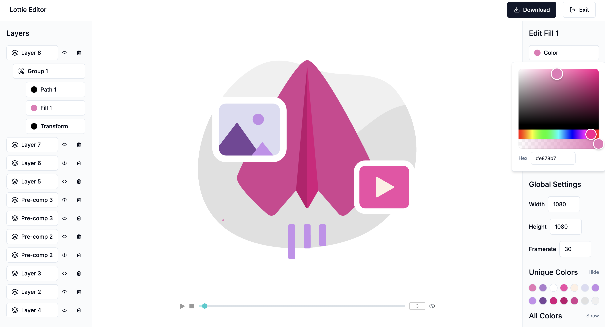

# Lottie Editor

This is a simple [Lottie animation](https://airbnb.io/lottie/#/) editor.

[Try it here](https://lottie-editor-sigma.vercel.app/)

## Features

- Import and export Lottie JSON files.
- List layers and shapes.
- Edit shape colours (via picker or **hex code input**).
- Adjust animation dimensions and framerate.
- Toggle between **Unique Colors** and **All Colors** view.
- Improved UX for easier layer management and editing.
- Preview changes in real time.

## Development

1. Clone the repository: `git clone https://github.com/chrisgreen1993/lottie-editor.git`
2. Navigate to the project directory: `cd lottie-editor`
3. Install dependencies: `npm install`
4. Start the application: `npm run dev`
